# resume-matcher-docker

# Resume Matcher – Docker Build & Deployment

Containerized 3 Tier React.js Resume Matcher app.

## 📺 Walkthrough
<iframe 
  width="560" height="315" 
  src="https://www.youtube.com/embed/LtgTu2vG5vQ?si=u3g9Emt9E1p6FXfZ" 
  title="Docker Build & Deployment Walkthrough" 
  frameborder="0" 
  allow="accelerometer; autoplay; clipboard-write; encrypted-media; gyroscope; picture-in-picture; web-share" 
  allowfullscreen>
</iframe>

---

## 🐳 Multi-stage Dockerfile
The Dockerfile uses a **multi-stage build**:

- Stage 1: Builder (Alpine) – Node.js 20 Alpine, installs build tools and libraries.  
- Stage 2: Runtime (Debian Slim) – Node.js 20 Slim, copies built output, exposes port 3000.

  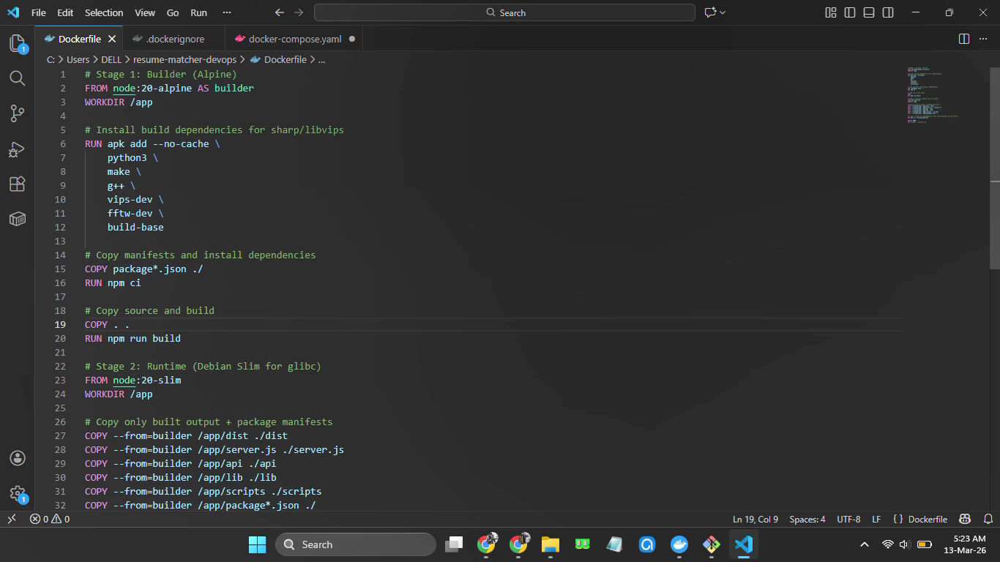
  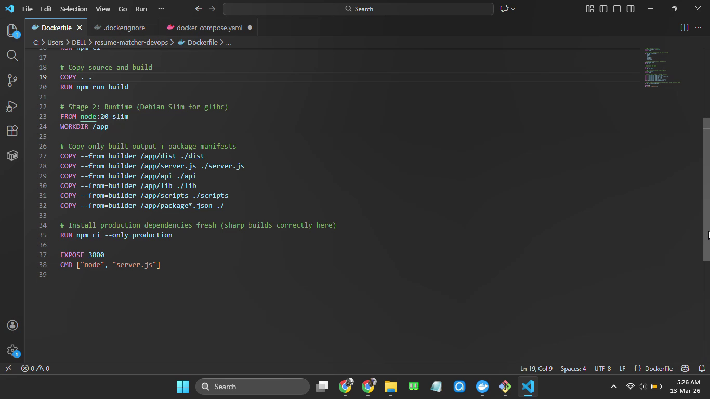

---

## 📂 .dockerignore
The `.dockerignore` file excludes unnecessary files to keep the build context small.

  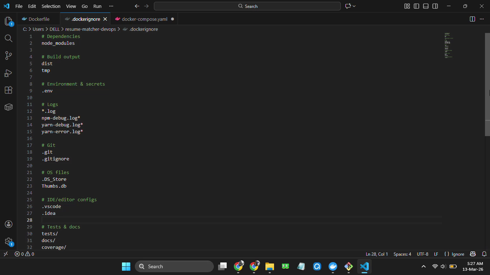
  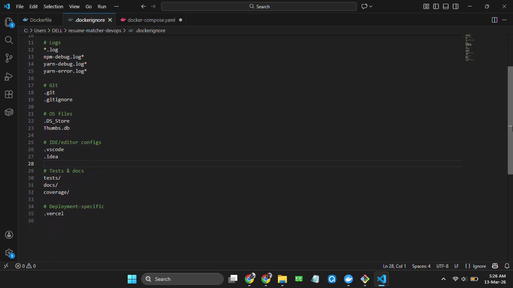

---

## ⚙️ Docker Compose
The `docker-compose.yml` orchestrates a three-service stack: web, db, nginx.

  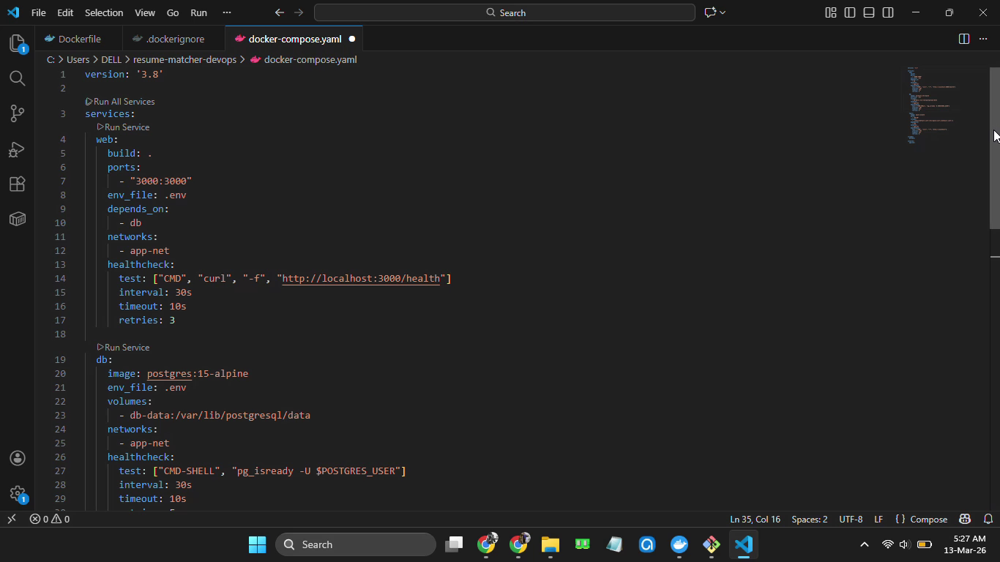
  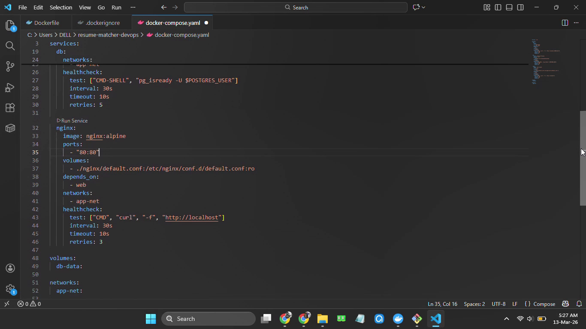

---

## 🚀 Containers are Running
Built and started containers with:

docker-compose up --build
docker-compose up

Verified container startup, healthchecks, logs, and exposed ports.

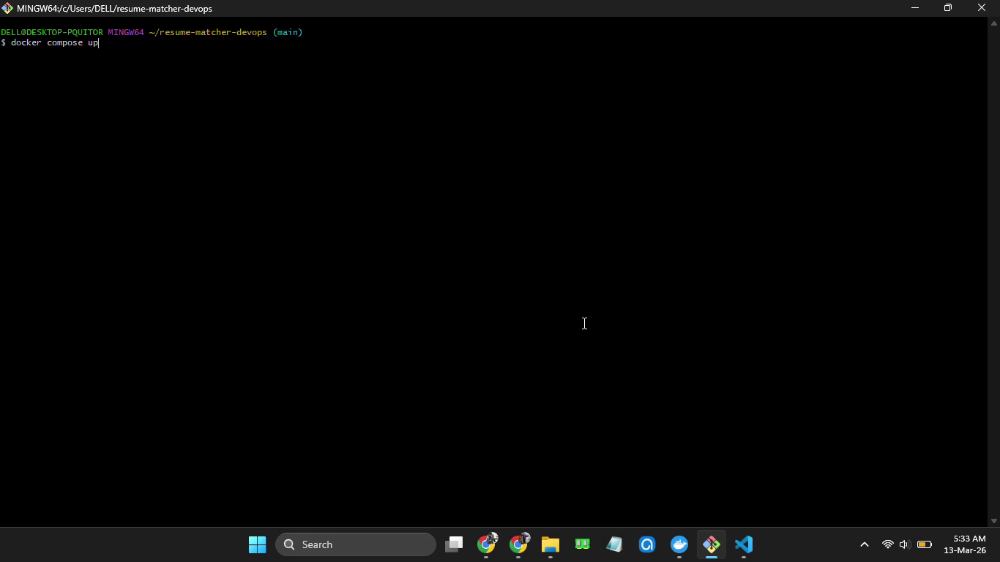
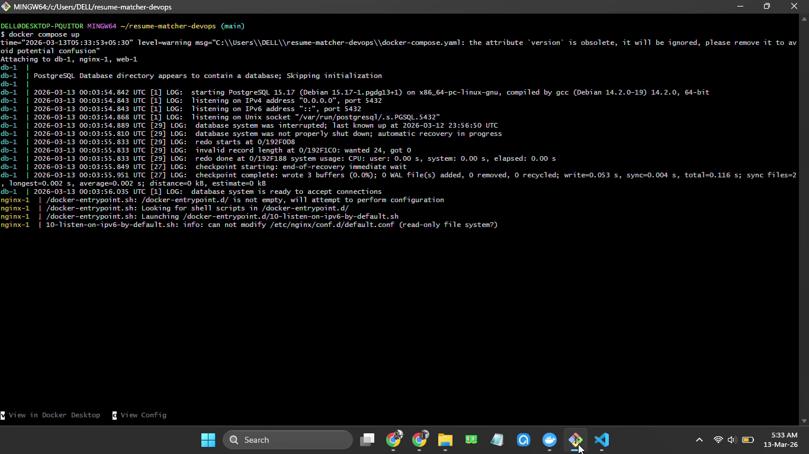
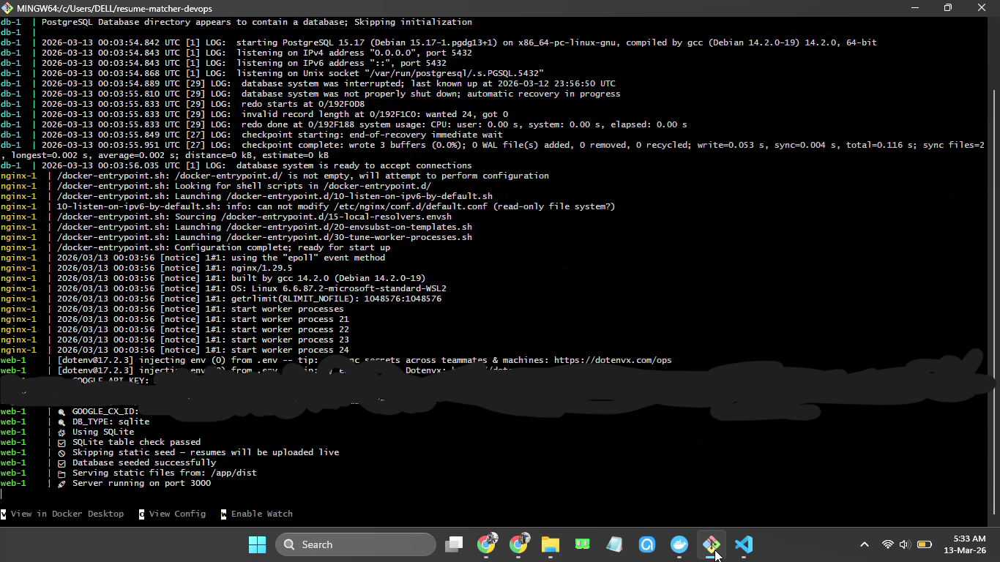
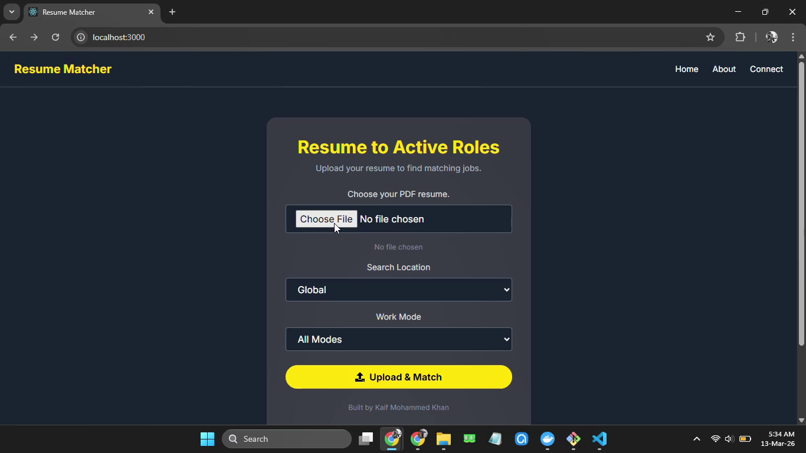
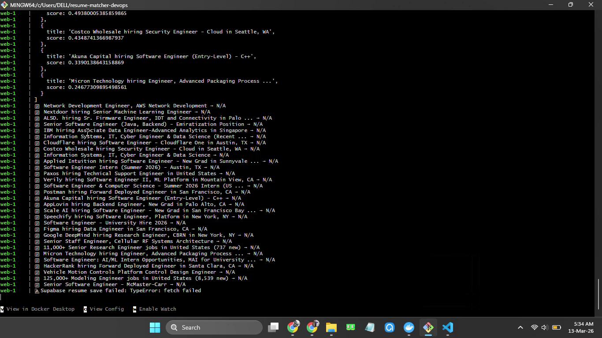
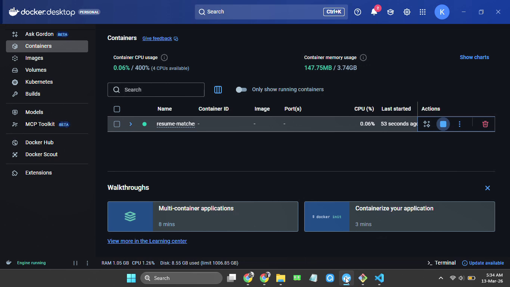

